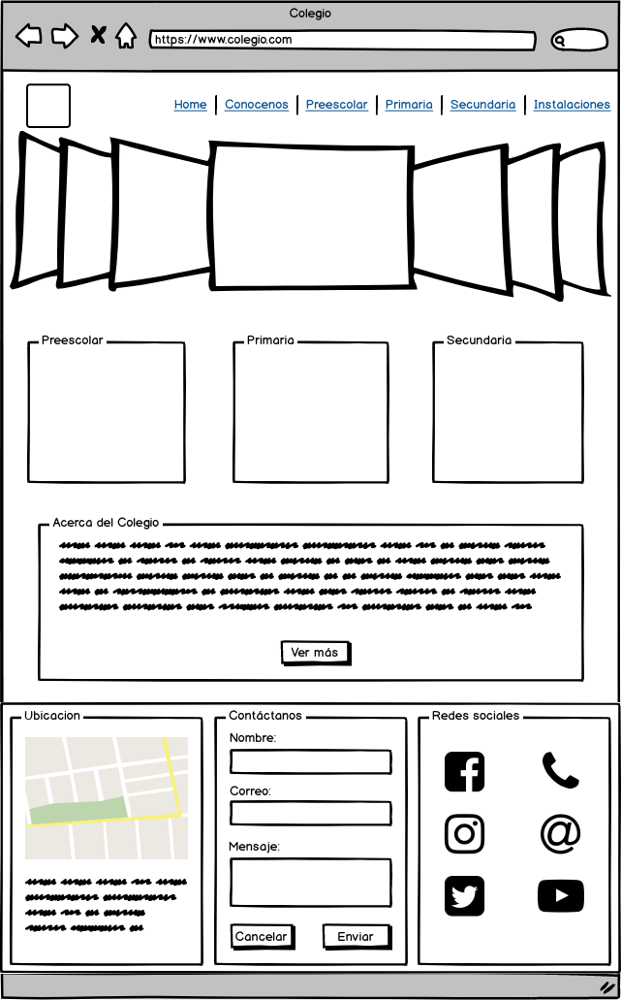

# Colegio

## Sitemap

##### Home

Site have an home page, since this the user may move throw the sections.

##### _Conócenos_

There is an "about" section named "Conocenos" where they find Services of the college, and its directory and ubication.

##### _Preescolar, Primaria & Secundaria_

Site have a detail page for each schoolar level (kinder garden, elementary and middle school) where users will find information about the study plan, schedule, inscription, etc.

##### _Galeria_

There is a module where users can see photos and information about the instalations and green areas at the inttitution.

##### _Contáctanos_

At last, there is a little form since users can send and request information to institution.

## Wirefrime

##### Home

Home page has a navigation bar at top with a little logo of the institution. Under this a carousel with images about schoolar level, services and instalations.

Also, a section of containers with a little of information about schoolar levels with links to their own views.

At last, a footer with ubication information, social networks and contacts.

##### _Conócenos_

"Conócenos" page contains a tabs view where users can select what see: mision, vision, objetives and values; institutional directory; services or ubication map.

The navigation bar as header and footer keeps on each module.

##### _Preescolar, Primaria & Secundaria_

These three views have the same structure, but with the information of each one.

First they have a carousel of images about the schoolar level, then the graduate profile, inscription information and schedule, with some images.

##### _Galeria_

On this view there is a carousel with ramdon photos about green areas, instalations and student life. Under, another photos and details.

##### _Contáctanos_

_Contáctanos_ view consist in an short form where users send or request information to inttitution, inputs needed are complet name as "Nombre", email address as "Correo", subject of messages as "Asunto" and the content message as "Mensaje"

"Nombre" and "Correo" are text inputs, "Asunto" is a checkbox with item as "request information", "Jobs oportunities", etc. And "Mensaje" is an text area due to its content could be longer.

